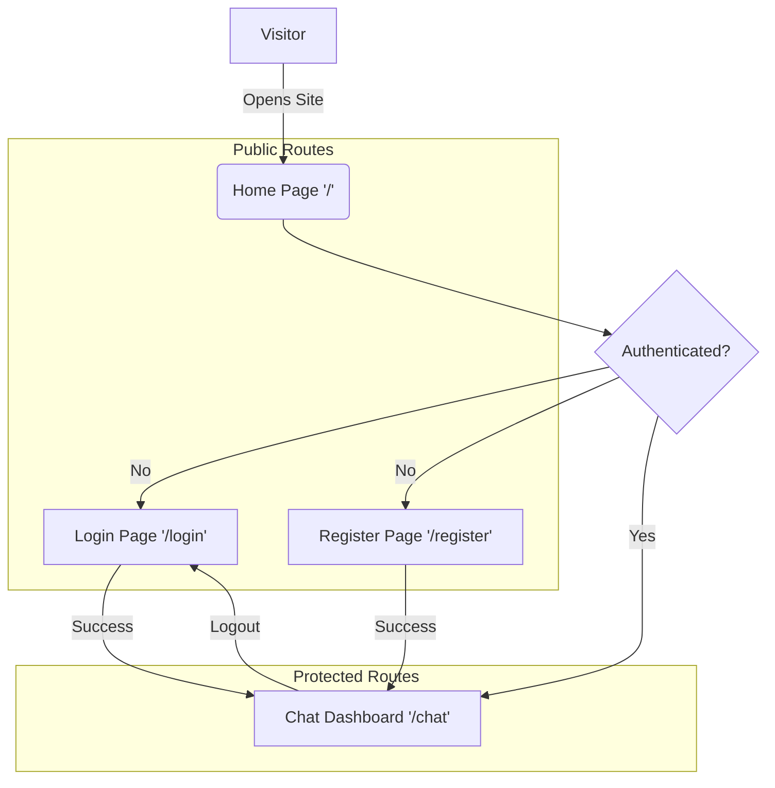

# Echo - Architecture & Sitemap

This document maps out the application structure, user navigation flow, and deployment architecture.

## 🗺️ Application Sitemap (User Journey)

Flow of user interaction within the application:



---

## 🏗️ System Architecture & Deployment

How the Frontend, Backend, and Database interact in the production environment:

```mermaid
graph LR
    subgraph "Client Side (Vercel)"
        Clients[User Browser]
        ReactApp[React Frontend\n(Vite + Tailwind)]
    end

    subgraph "Server Side (Render.com)"
        API[Express API Server]
        Socket[Socket.io Server]
    end

    subgraph "Database (MongoDB Atlas)"
        DB[(MongoDB)]
    end

    Clients -->|HTTPS Request| ReactApp
    ReactApp -->|REST API (Axios)| API
    ReactApp -.->|WebSocket (Real-time)| Socket

    API -->|Mongoose Queries| DB
    Socket -->|Store/Retrieve Chats| DB
```

### Key Components

1.  **Frontend (Vercel)**:
    - Hosted on Vercel's Edge Network.
    - Serves the React Application.
    - Handles Routing (React Router) and State (Zustand).

2.  **Backend (Render)**:
    - Hosted as a Web Service on Render.com.
    - Exposes REST API endpoints (`/api/auth`, `/api/messages`).
    - Manages WebSocket connections via `socket.io`.

3.  **Database (MongoDB)**:
    - Stores Users, Messages, and Conversations.
    - Connected via Mongoose.

## 📂 File Structure Overview

- **`/client`**: Frontend Logic
  - `App.jsx`: Main routing logic.
  - `context/`: Auth & Socket providers.
  - `services/`: API configuration pointing to Render backend.
- **`/server`**: Backend Logic
  - `server.js`: Entry point.
  - `socket/`: Real-time event handlers.
  - `controllers/`: Business logic for API endpoints.
